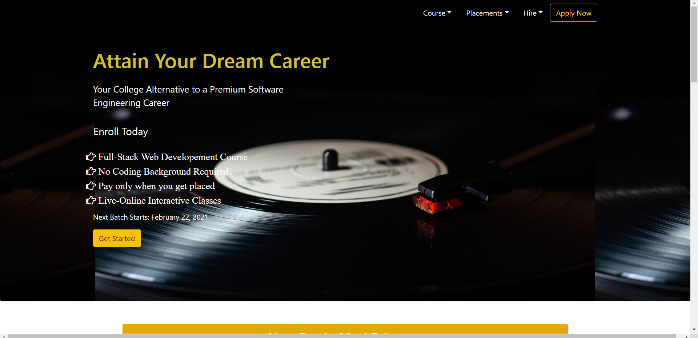
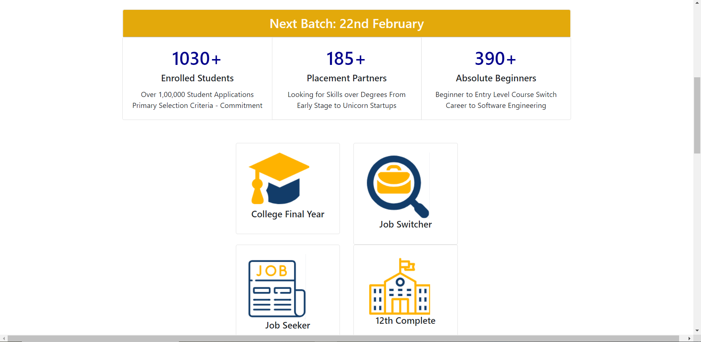
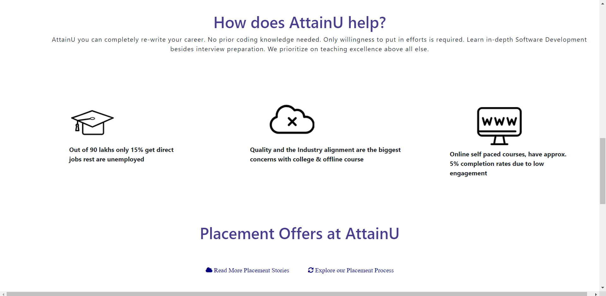
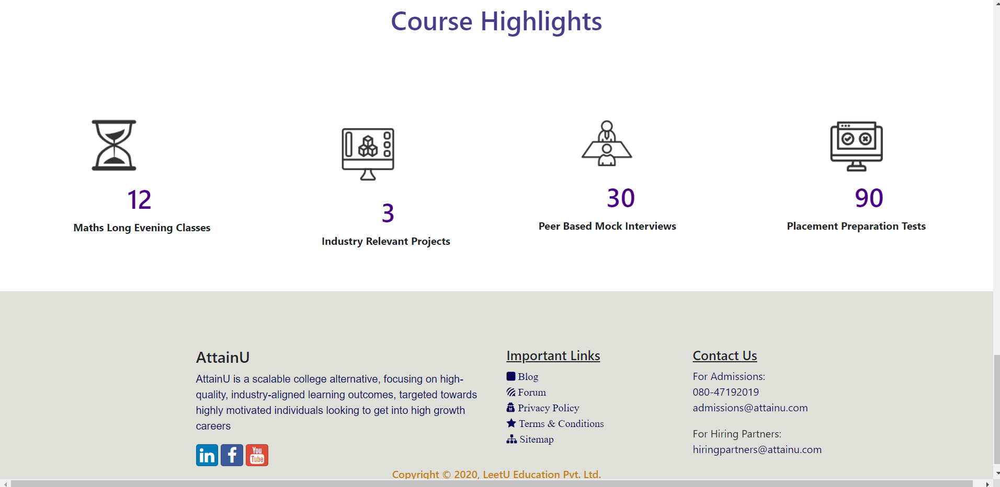
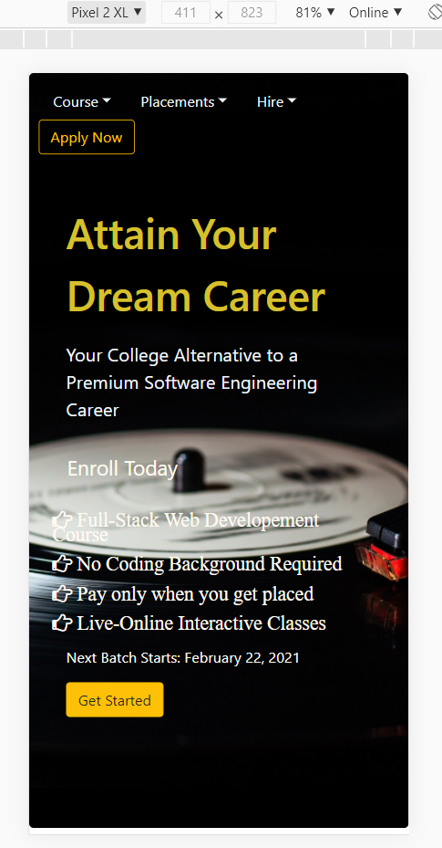
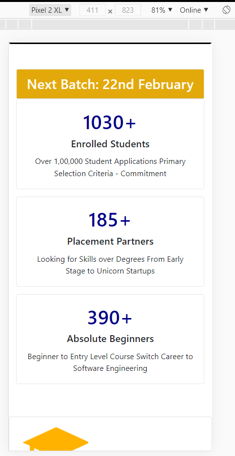
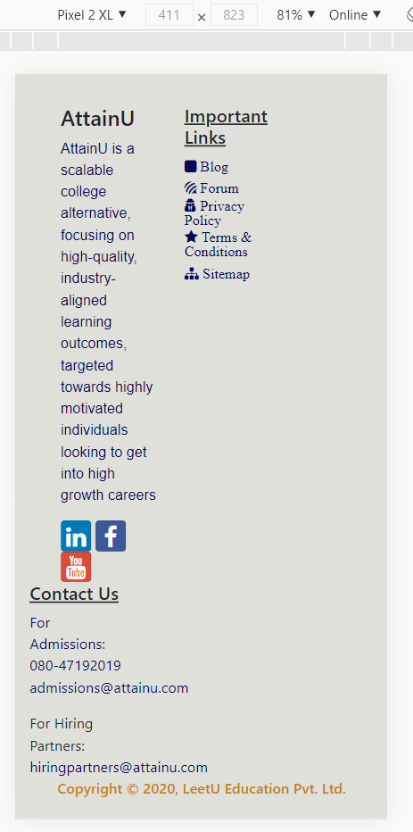

# It's a Clone Website.
* 

using mobile-first framework Bootstrap.
## Getting Started
- `npm install` to install all required dependencies.
- `npm install bootstrap` to add bootstrap into your application.
- `npm install lite-server` to install lite server.
- `npm start` to start the local server.

## Screenshots
### Web View

### Mobile View

